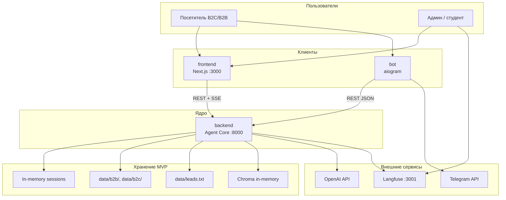
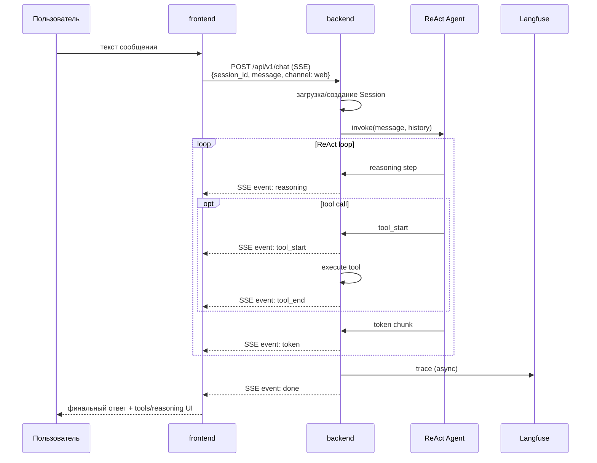
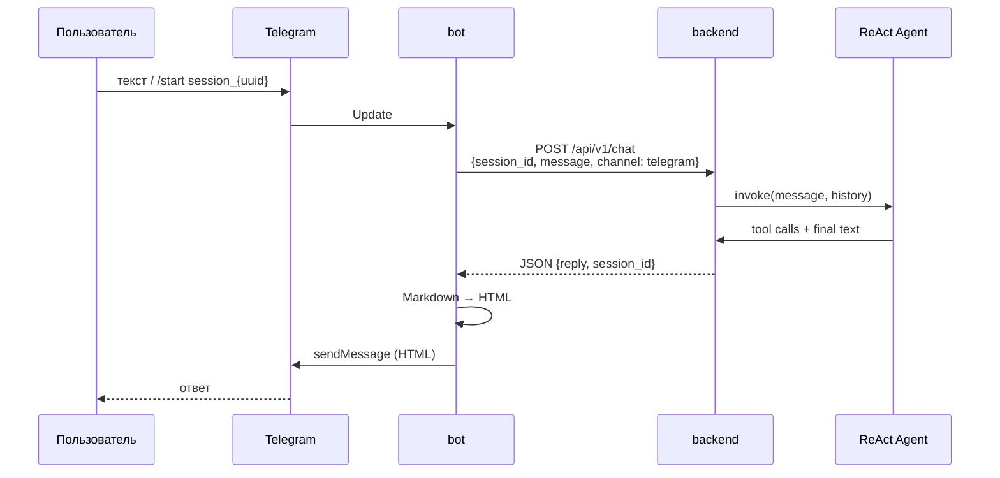
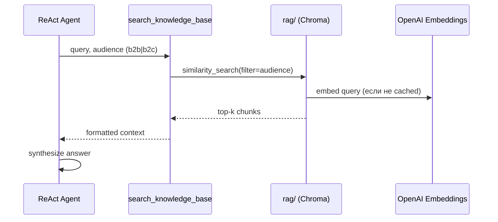
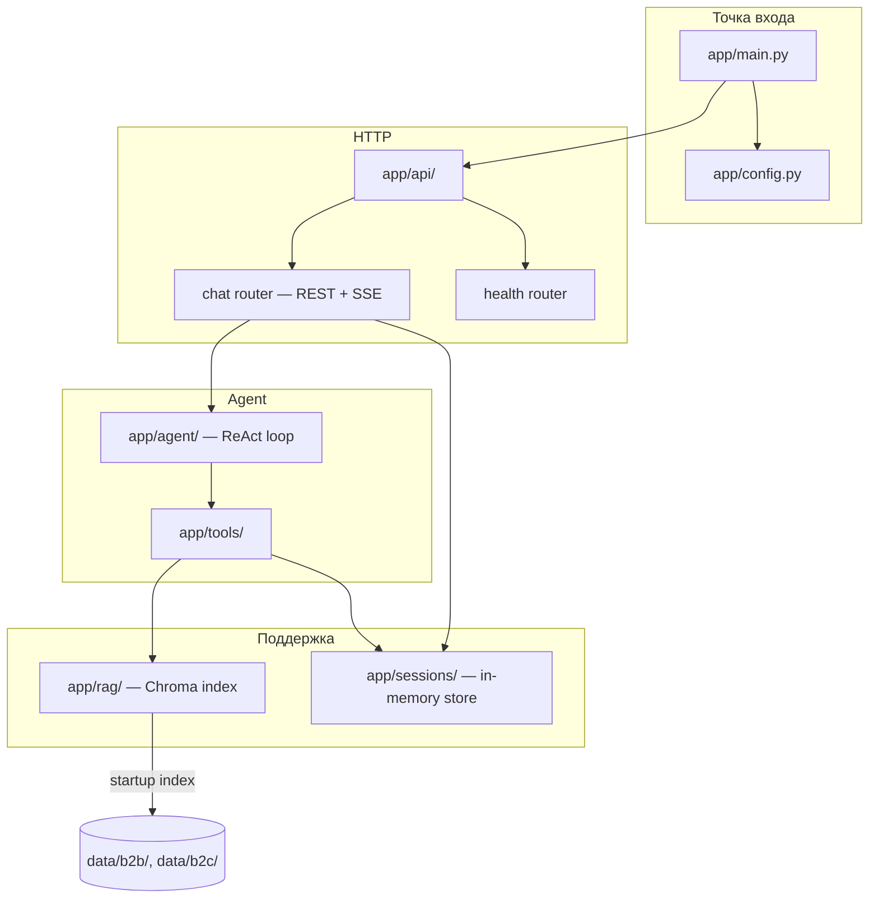
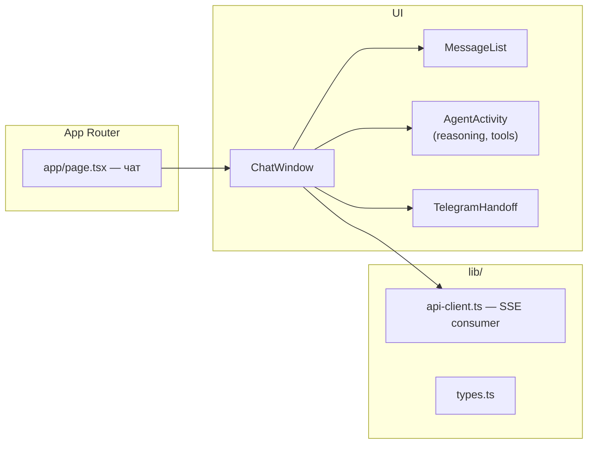
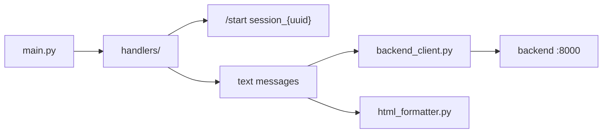

# Архитектура системы

> Высокоуровневое описание компонентов, потоков данных и ссылок на детали.
> Продуктовое видение и роли — в [vision.md](vision.md). Доменные сущности — в [vision.md](vision.md), раздел 7.

---

## Контекст системы

Посетители llmstart.ru и пользователи Telegram общаются с **LLMStart Agent** через веб-виджет (Next.js) или Telegram-бот (aiogram). Вся бизнес-логика — ReAct-агент, RAG, tools, сессии — живёт в **backend** (FastAPI). Клиенты тонкие: передают сообщения в API с параметром `channel` и отображают ответ (SSE + reasoning/tools в виджете, HTML в Telegram).



---

## Контейнеры и ответственность

| Компонент | Назначение | Технологии | Документация |
|-----------|-----------|-----------|-------------|
| **backend** | Agent Core: ReAct, tools, RAG, sessions, REST/SSE API | Python 3.12, FastAPI, LangChain, Chroma | [ADR-0001](../adrs/0001-react-agent-core.md) |
| **frontend** | Standalone виджет: чат, SSE-стриминг, reasoning/tools UI, развилка в Telegram | Next.js, Tailwind, shadcn/ui | — |
| **bot** | Telegram-адаптер: long polling, вызов backend API, HTML-форматирование | aiogram | — |
| **Langfuse** | Observability: traces агента | Langfuse + Postgres (Docker) | [integrations.md](integrations.md) |
| **data/** | База знаний (b2b/b2c) и мок-CRM (leads.txt) | PDF, MD, plain text | — |

---

## Взаимодействие клиентов с ядром

### Web: сообщение → SSE-стрим



### Telegram: сообщение → REST



### RAG: tool `search_knowledge_base`



Контракты путей, схем и SSE-событий — в [api-contracts.md](api-contracts.md).

---

## SSE-протокол (виджет)

Backend стримит события через `text/event-stream`. Типы событий:

| Event | Payload | Назначение |
|-------|---------|------------|
| `reasoning` | `{step, content}` | Шаг ReAct / промежуточное рассуждение |
| `tool_start` | `{name, args}` | Начало вызова инструмента |
| `tool_end` | `{name, result}` | Результат инструмента |
| `token` | `{content}` | Фрагмент финального ответа |
| `done` | `{session_id, reply}` | Завершение стрима |

---

## Переход виджет → Telegram

1. Виджет показывает кнопку «Перейти в Telegram».
2. Backend уже знает `session_id` текущего диалога.
3. Ссылка: `https://t.me/{bot_username}?start=session_{uuid}`.
4. Bot при `/start session_{uuid}` привязывает Telegram chat к существующей Session в backend.
5. Дальнейшие сообщения идут с `channel=telegram`, история сохранена (in-memory).

---

## backend — внутренняя структура



| Модуль | Ответственность |
|--------|-----------------|
| `app/api/` | HTTP-роутеры: `POST /api/v1/chat` (JSON + SSE), `GET /health` |
| `app/agent/` | LangChain ReAct agent, system prompt, Langfuse callback |
| `app/tools/` | `search_knowledge_base`, `list_b2c_products`, `save_lead`, `create_payment_link`, `confirm_payment` |
| `app/rag/` | Загрузка PDF/MD, Chroma in-memory, фильтр b2b/b2c, retrieval |
| `app/sessions/` | In-memory dict: Session (messages, channel, segment, payment) |
| `app/config.py` | Env-конфиг (OpenAI, Langfuse, paths) — fail fast при старте |

Структура каталогов:

```
backend/
├── app/
│   ├── main.py
│   ├── config.py
│   ├── api/
│   │   ├── router.py
│   │   ├── chat.py
│   │   └── health.py
│   ├── agent/
│   │   ├── core.py
│   │   └── prompts.py
│   ├── tools/
│   │   ├── knowledge.py
│   │   ├── products.py
│   │   ├── leads.py
│   │   └── payments.py
│   ├── rag/
│   │   ├── indexer.py
│   │   └── retriever.py
│   └── sessions/
│       ├── store.py
│       └── models.py
├── tests/
└── pyproject.toml
```

---

## frontend — внутренняя структура

Standalone Next.js-приложение (не embeddable script в MVP).



| Часть | Ответственность |
|-------|-----------------|
| `lib/api-client.ts` | `POST /api/v1/chat` с SSE: парсинг `reasoning`, `tool_*`, `token`, `done` |
| `AgentActivity` | «Инженерная» панель: шаги ReAct, вызванные tools |
| `TelegramHandoff` | Кнопка с deep link `session_{uuid}` |

```
frontend/
├── app/
│   ├── layout.tsx
│   └── page.tsx
├── components/
│   ├── chat/
│   └── ui/          # shadcn
├── lib/
│   ├── api-client.ts
│   └── types.ts
└── package.json
```

---

## bot — внутренняя структура



| Модуль | Ответственность |
|--------|-----------------|
| `handlers/` | aiogram routers: `/start`, текстовые сообщения |
| `backend_client.py` | `POST /api/v1/chat`, `channel=telegram` |
| `html_formatter.py` | Markdown → Telegram HTML |

Bot **не** вызывает tools и **не** содержит agent logic — только HTTP-клиент к backend.

```
bot/
├── main.py
├── handlers/
│   ├── start.py
│   └── messages.py
├── backend_client.py
├── html_formatter.py
└── config.py
```

---

## RAG — Chroma in-memory

1. **При старте backend:** сканирование `data/b2b/` и `data/b2c/` (PDF, MD).
2. **Chunking + embeddings:** OpenAI Embeddings API.
3. **Хранение:** Chroma in-memory collection с metadata `audience: b2b | b2c`.
4. **Retrieval:** `search_knowledge_base` фильтрует по `audience` из Session segment.
5. **Перезапуск:** индекс пересобирается при каждом старте (нет персистентного vector store в MVP).

---

## Деплой — локально

Весь стек поднимается через **docker-compose** + `make dev`.

### Сервисы docker-compose

| Сервис | Порт | Описание |
|--------|------|----------|
| `backend` | 8000 | Agent Core, healthcheck `GET /health` |
| `frontend` | 3000 | Next.js виджет |
| `bot` | — | aiogram long polling (без входящего порта) |
| `langfuse` | 3001 | UI observability |
| `langfuse-db` | — | Postgres для Langfuse (internal) |

### Команды

```bash
make up          # docker compose up -d (langfuse + postgres)
make dev         # backend + frontend + bot локально или в compose
make dev-backend # только backend :8000
make dev-frontend# только frontend :3000
```

### CORS (dev)

Frontend (`http://localhost:3000`) → backend (`http://localhost:8000`). Backend разрешает origin `http://localhost:3000` в dev-режиме.

### Health checks

- `GET http://localhost:8000/health` → `200 {"status": "ok"}`
- docker-compose: `healthcheck` на backend по этому endpoint

### Переменные окружения

Секреты — только через `.env` (не в репо). Шаблон — `.env.example`. Обязательные: `OPENAI_API_KEY`, `TELEGRAM_BOT_TOKEN`, Langfuse keys. Для Azure-совместимого LLM endpoint — также `OPENAI_API_BASE` и deployment names в `OPENAI_MODEL` / `OPENAI_EMBEDDING_MODEL` (см. [integrations.md](integrations.md)).

---

## Деплой — production

**MVP: только локальная разработка.** Production-окружение (VPS, CI/CD, домены) — в roadmap. Текущая архитектура спроектирована production-grade (health checks, observability, разделение каналов), но деплой за пределами localhost не входит в scope MVP.

---

## Связанные документы

- [vision.md](vision.md) — сценарии, компоненты, доменные сущности
- [user-scenarios.md](user-scenarios.md) — детализация потоков
- [api-contracts.md](api-contracts.md) — REST/SSE контракты
- [integrations.md](integrations.md) — OpenAI, Langfuse, Telegram
- [../adrs/](../adrs/) — архитектурные решения (ADR)
