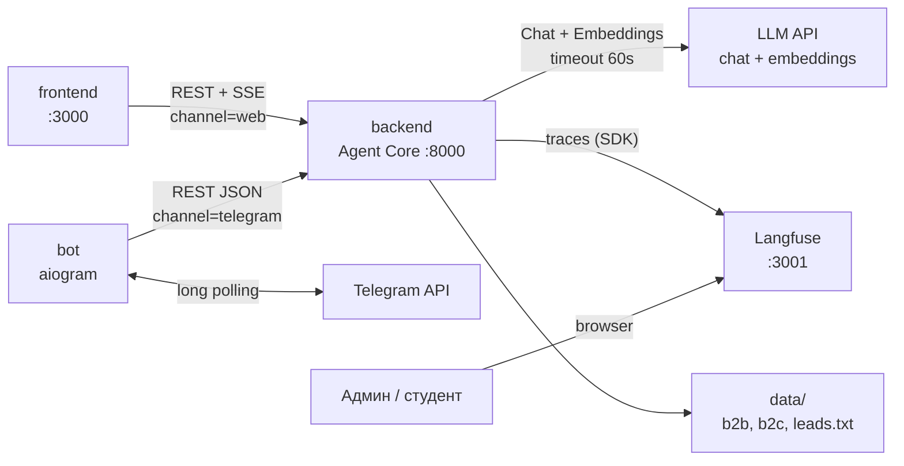

# Внешние интеграции

> Внешние системы и внутренние API, с которыми взаимодействует LLMStart Agent.

---

## 1. Backend REST API (внутренний)

Единая точка входа для **frontend** и **bot**. Вся agent logic — только здесь.

| Параметр | Значение |
|----------|---------|
| Назначение | Чат с агентом, healthcheck |
| Направление | In (клиент → backend) |
| Протокол | HTTP REST, JSON; SSE для web-канала |
| Базовый URL (локально) | `http://localhost:8000` |
| Документация | `/docs` (Swagger UI) |

Полные контракты — в [`api-contracts.md`](api-contracts.md).

| Эндпоинт | Сценарий |
|----------|----------|
| `POST /api/v1/chat` | Отправка сообщения; web — SSE-стрим, telegram — JSON |
| `GET /health` | Проверка работоспособности backend |

**Клиенты:**

| Клиент | Протокол | `channel` |
|--------|----------|-----------|
| frontend (`:3000`) | REST + SSE | `web` |
| bot (aiogram) | REST JSON | `telegram` |

---

## 2. Внешние системы

### LLM API (OpenAI и Azure-совместимые endpoints)

Backend поддерживает два режима подключения к LLM и embeddings:

| Режим | Условие | Клиент LangChain |
|-------|---------|------------------|
| **OpenAI** (по умолчанию) | `OPENAI_API_BASE` не задан | `ChatOpenAI` → `api.openai.com` |
| **Azure-совместимый** | `OPENAI_API_BASE` задан | `AzureChatOpenAI` → кастомный endpoint |

[Документация OpenAI](https://platform.openai.com/docs) · [Azure OpenAI](https://learn.microsoft.com/en-us/azure/ai-services/openai/)

| Параметр | Значение |
|----------|---------|
| Назначение | LLM (ReAct-агент) и embeddings (RAG) |
| Направление | Out (backend → LLM provider) |
| Протокол | HTTPS REST (OpenAI Chat Completions / Azure OpenAI API) |
| Критичность | **MVP — обязательна** |
| Timeout | 60 сек на запрос (`OPENAI_TIMEOUT_SEC`) |

**Модели** (задаются через `.env`, см. `.env.example`):

| Задача | OpenAI (default) | Azure-совместимый (пример) |
|--------|------------------|----------------------------|
| ReAct-агент | `gpt-4o` | deployment name провайдера (напр. `claude-sonnet-4@20250514`) |
| RAG embeddings | `text-embedding-3-small` | deployment name провайдера (напр. `text-embedding-3-small-1`) |

**Подключение:** LangChain OpenAI integration (`langchain-openai`). Backend вызывает Chat Completions для agent loop и Embeddings API при индексации/retrieval Chroma.

**Health probe:** `GET /health` проверяет доступность LLM API:
- без `OPENAI_API_BASE` — `GET https://api.openai.com/v1/models` с `Authorization: Bearer`
- с `OPENAI_API_BASE` — `GET {OPENAI_API_BASE}/openai/models` с заголовком `api-key`

**Поведение при ошибке:** backend возвращает клиенту fallback-сообщение «Сервис временно недоступен, попробуйте позже» (не HTTP 503 на уровне transport для SSE; для JSON-ответа — тело с сообщением об ошибке). Ошибка логируется на уровне `ERROR` с `exc_info=True`; тело запроса и тексты диалогов не логируются.

---

### Langfuse

[Документация](https://langfuse.com/docs) · [Self-hosted Docker](https://langfuse.com/self-hosting)

| Параметр | Значение |
|----------|---------|
| Назначение | Traces агента: шаги ReAct, tools, latency, tokens |
| Направление | Out (backend → Langfuse) |
| Протокол | HTTPS REST (Langfuse SDK) |
| Критичность | **MVP — обязательна** |
| URL (локально) | `http://localhost:3001` |

**Подключение:** Langfuse Python SDK + LangChain callback handler. Langfuse поднимается self-hosted через официальный Docker-образ (latest) + Postgres (`langfuse-db`) в docker-compose.

**Поведение:** backend **не стартует** без валидной конфигурации Langfuse (fail fast). Traces пишутся на каждый вызов agent loop.

**Пользователи:** админ / преподаватель / студент — UI Langfuse для разбора traces (ADM-1, STU-1).

---

### Telegram Bot API

[Документация](https://core.telegram.org/bots/api)

| Параметр | Значение |
|----------|---------|
| Назначение | Канал общения с пользователем |
| Направление | Bidirectional (bot ↔ Telegram API) |
| Протокол | HTTPS REST |
| Критичность | **MVP — обязательна** (для Telegram-канала) |
| Режим | Long polling (без webhook) |

**Подключение:** aiogram 3.x, long polling к `api.telegram.org`. Bot **не** содержит agent logic — только проксирует сообщения в backend API.

**Deep link handoff:** `https://t.me/{TELEGRAM_BOT_USERNAME}?start=session_{uuid}` — привязка Telegram chat к существующей Session.

**Поведение при недоступности backend:** bot отвечает пользователю «Сервис недоступен, попробуйте позже».

---

## 3. Внутренние интеграции (не внешние сервисы)

Моки и файловое хранилище — часть backend, без внешних API.

| Интеграция | Назначение | Реализация |
|------------|-----------|------------|
| **Мок-CRM** | Сохранение лидов | Tool `save_lead` → append в `data/leads.txt` |
| **Мок-платежи** | Ссылка на оплату, подтверждение | Tools `create_payment_link`, `confirm_payment` — in-memory в Session |
| **Knowledge Base** | RAG-источник | Файлы `data/b2b/`, `data/b2c/` (PDF, MD) → Chroma in-memory при старте |
| **In-memory sessions** | История диалога | `app/sessions/` — dict в памяти backend |

> Production-платежи и CRM — в roadmap, см. [ADR-0003](../adrs/0003-mock-payments-crm.md).

---

## 4. Диаграмма интеграций

---

## 5. Переменные окружения

Секреты — только через `.env` (не коммитится). Шаблон — `.env.example`.

| Переменная | Компонент | Обязательна | Описание |
|------------|-----------|-------------|----------|
| `OPENAI_API_KEY` | backend | да | API-ключ LLM-провайдера |
| `OPENAI_API_BASE` | backend | нет | Azure-совместимый endpoint (без `/openai` суффикса); если не задан — `api.openai.com` |
| `OPENAI_API_VERSION` | backend | нет | API version для Azure-режима; default: `2024-02-01` |
| `OPENAI_MODEL` | backend | нет | Модель или deployment name; default: `gpt-4o` |
| `OPENAI_EMBEDDING_MODEL` | backend | нет | Embedding deployment; default: `text-embedding-3-small` |
| `OPENAI_TIMEOUT_SEC` | backend | нет | Default: `60` |
| `LANGFUSE_PUBLIC_KEY` | backend | да | Public key Langfuse |
| `LANGFUSE_SECRET_KEY` | backend | да | Secret key Langfuse |
| `LANGFUSE_HOST` | backend | да | Default: `http://localhost:3001` |
| `TELEGRAM_BOT_TOKEN` | bot | да | Token от @BotFather |
| `TELEGRAM_BOT_USERNAME` | frontend, bot | да | Username без `@` (deep link) |
| `BACKEND_API_KEY` | backend, bot, frontend | да | Shared secret для `Authorization: Bearer` |
| `BACKEND_URL` | bot, frontend | нет | Default: `http://localhost:8000` |
| `CORS_ORIGINS` | backend | нет | Default: `http://localhost:3000` |
| `LOG_LEVEL` | backend, bot | нет | Default: `INFO` |

Config-класс backend падает с понятной ошибкой при отсутствии обязательных переменных — на старте процесса.

---

## 6. Зависимости и риски

| Интеграция | Риск | Митигация |
|-----------|------|----------|
| **LLM API** | Недоступность / rate limit | Timeout 60s; fallback-сообщение пользователю; логирование ошибки |
| **LLM API** | Стоимость (chat + embeddings) | Traces в Langfuse (tokens/cost); лимит сообщений в dev-режиме |
| **Langfuse** | Недоступность | Обязателен для MVP — docker-compose healthcheck; fail fast при старте backend |
| **Telegram API** | Недоступность backend | Bot отвечает «сервис недоступен»; retry long polling |
| **In-memory sessions** | Потеря при рестарте | Документировано; Postgres в roadmap ([ADR-0002](../adrs/0002-in-memory-sessions.md)) |
| **Мок-платежи** | Нет реальной оплаты | Осознанное ограничение MVP; roadmap |

**Критичны для MVP:** LLM API, Langfuse, backend API. Telegram API — критичен для Telegram-канала; web-канал работает без него.

---

## Связанные документы

- [architecture.md](architecture.md) — потоки данных, порты, docker-compose
- [api-contracts.md](api-contracts.md) — REST/SSE контракты
- [vision.md](vision.md) — внешние связи (обзор)
- [../adrs/](../adrs/) — ADR по мокам и sessions
