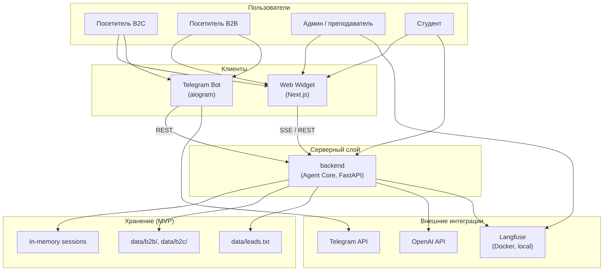

# Техническое видение проекта

---

## 1. Система в целом

**LLMStart Agent** — мультиканальный AI-ассистент для llmstart.ru. Ядро системы — **backend** (Agent Core на FastAPI): ReAct-агент с инструментами, RAG и бизнес-логикой воронки. Веб-виджет (Next.js) и Telegram-бот (aiogram) — тонкие адаптеры: они передают сообщения в Core и отображают ответ с учётом канала (`web` / `telegram`).

Принцип «один мозг — много каналов»: вся логика диалога, подбора продукта и оплаты живёт в backend; клиенты не дублируют бизнес-правила.

---

## 2. Роли

| Роль | Описание |
|------|----------|
| **Посетитель (B2C)** | Физлицо: выбирает курс из B2C-каталога, получает консультацию, мок-оплату и передаёт контакт |
| **Посетитель (B2B)** | Представитель компании: получает ответы из B2B-базы знаний о корпоративном обучении и разработке |
| **Администратор / преподаватель** | Проверяет качество агента, смотрит traces в Langfuse, использует виджет как демо на занятиях |
| **Студент курса** | Изучает архитектуру агента на рабочем стенде: Core, RAG, tools, каналы, observability |

---

## 3. Пользовательские сценарии

> Детализация с требованиями к данным — в [`user-scenarios.md`](user-scenarios.md).

### Посетитель (B2C)
- **B2C-1: Уточнение запроса** — агент выясняет потребность, определяет сегмент B2C
- **B2C-2: Подбор продукта** — рекомендация из каталога + RAG по `data/b2c/`
- **B2C-3: Мок-оплата** — генерация мок-ссылки на оплату выбранного продукта
- **B2C-4: Подтверждение оплаты** — приём текстового «оплатил» (мок)
- **B2C-5: Фиксация лида** — сохранение контакта в `data/leads.txt`
- **B2C-6: Переход в Telegram** — развилка на сайте: продолжить в виджете или перейти в бот

### Посетитель (B2B)
- **B2B-1: Уточнение запроса** — агент выясняет потребность, определяет сегмент B2B
- **B2B-2: Консультация по B2B** — ответы из RAG по `data/b2b/` (корпоративное обучение, разработка)
- **B2B-3: Фиксация лида** — сбор контакта для передачи команде LLMStart

### Администратор / преподаватель
- **ADM-1: Просмотр traces** — анализ шагов агента, tools и reasoning в Langfuse
- **ADM-2: Демо на занятии** — показ «инженерной» работы агента в веб-виджете (SSE, tools, reasoning)

### Студент курса
- **STU-1: Изучение архитектуры** — запуск стека локально, трассировка запроса от виджета/bot до Core

---

## 4. Архитектура (high-level)

> Диаграммы контейнеров и последовательностей — в [`architecture.md`](architecture.md).



---

## 5. Компоненты системы

### backend (Agent Core)
- ReAct-агент (LangChain), инструменты, RAG, in-memory история диалога, REST/SSE API
- Не содержит UI и не знает деталей Telegram-разметки — только `channel`
- **Статус:** MVP

### Web Widget (frontend)
- Next.js виджет: SSE-стриминг, стиль llmstart.ru, отображение reasoning / tools / шагов
- Развилка «виджет / Telegram»; не дублирует логику агента
- **Статус:** MVP

### Telegram Bot (bot)
- aiogram, long polling, вызов backend API, HTML-форматирование ответов
- **Статус:** MVP

### RAG / Knowledge Base
- Файлы PDF/MD в `data/b2b/` и `data/b2c/`, фильтрация по аудитории
- **Статус:** MVP

### Langfuse (Observability)
- Traces агента локально в Docker
- **Статус:** MVP

### PostgreSQL
- Персистентные сессии, диалоги, лиды
- **Статус:** Планируется

### Production-платежи и CRM
- Реальная платёжка, интеграция с CRM вместо `leads.txt`
- **Статус:** Планируется

### Эскалация эксперту
- Передача диалога живому консультанту
- **Статус:** Планируется

### Guardrails
- Фильтрация off-topic, политики безопасности
- **Статус:** Планируется

---

## 6. Структура проекта

```
llmstart-agent/
├── backend/           # Agent Core: FastAPI, LangChain, tools, RAG, API
├── frontend/          # Next.js виджет (SSE, tools & reasoning UI)
├── bot/               # Telegram-бот (aiogram, long polling)
├── data/
│   ├── b2b/           # B2B база знаний (PDF, MD)
│   ├── b2c/           # B2C база знаний (PDF, MD)
│   └── leads.txt      # Мок-CRM: сохранённые лиды
└── docs/
    ├── concept/
    ├── adrs/
    ├── roadmap.md
    └── sprints/
```

---

## 7. Доменные сущности

> Персистентная модель данных — в roadmap (Postgres). В MVP сущности живут in-memory или в файлах.

| Сущность | Смысл |
|----------|-------|
| **Session** | In-memory диалог: история сообщений, `channel`, сегмент B2B/B2C, идентификатор сессии |
| **Lead** | Контакт потенциального клиента (имя, email/telegram, продукт, сегмент) — запись в `leads.txt` |
| **Product** | Позиция B2C-каталога (ai-agents-combo, agents, deep-agents и др.) |
| **Payment** | Мок-ссылка на оплату и статус «оплачено» в рамках сессии |

---

## 8. Внешние связи

> Детализация — в [`integrations.md`](integrations.md).

| Интеграция | Назначение |
|------------|------------|
| **OpenAI API** | LLM (ReAct) и embeddings (RAG) |
| **Langfuse** | Traces, observability агента (локально в Docker) |
| **Telegram Bot API** | Канал общения через aiogram (long polling) |

---

## 9. Принципы разработки

- **KISS** — простые решения, никакой избыточной сложности
- **YAGNI** — реализуем только то, что нужно сейчас
- **DRY** — повторяющаяся логика выносится в отдельные модули
- **Один мозг — много каналов** — бизнес-логика только в backend; адаптеры каналов тонкие

---

## 10. Технологии

| Область | Решение |
|---------|---------|
| Runtime (backend) | Python 3.12+, uv |
| Backend framework | FastAPI + uvicorn |
| Agent framework | LangChain (ReAct) |
| LLM & embeddings | OpenAI API |
| Observability | Langfuse (Docker, local) |
| Frontend | Next.js (App Router), Tailwind CSS 4, shadcn/ui |
| Telegram | aiogram, long polling |
| Хранение MVP | Файлы (`data/`), in-memory sessions |

---

## 11. Архитектурные и прочие принятые решения

> Полный список ADR — в [`docs/adrs/`](../adrs/).

| № | Решение | Статус |
|---|---------|--------|
| [ADR-0001](../adrs/0001-react-agent-core.md) | Agent Core на LangChain ReAct + tools | Принято |
| [ADR-0002](../adrs/0002-in-memory-sessions.md) | In-memory сессии без Postgres в MVP | Принято |
| [ADR-0003](../adrs/0003-mock-payments-crm.md) | Моки платежей и CRM (`leads.txt`) | Принято |
